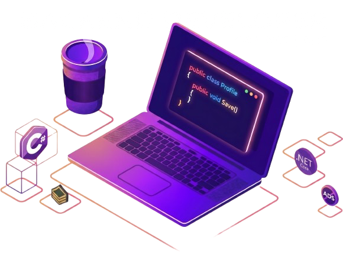

# Alejandro Souza - #OpenToWork

  Sou um desenvolvedor <strong>Backend focado no ecossistema C# e .NET</strong>, atualmente em transição da carreira militar para o universo da tecnologia. <strong>Análise e Desenvolvimento de Sistemas (Unopar)</strong>, encaro o desenvolvimento de software com a mesma disciplina e precisão que a rotina no Exército Brasileiro me ensinou.

  Meu objetivo é construir aplicações que não apenas funcionem, mas que sejam <strong>escaláveis, robustas e de manutenção facilitada</strong>. Acredito que um bom código é aquele que respeita as boas práticas de arquitetura e padrões de projeto (SOLID, Clean Code).

### 🛠️ O que eu domino:

  🦄 <strong>Linguagens:</strong> C# (.NET Core/MVC), SQL (Server/PostgreSQL)..

  💼 <strong>Ferramentas & Frameworks:</strong> ASP.NET Core, Entity Framework Core, Git/GitHub, Docker (estudando), JetBrains Rider e ambiente macOS.

  ⚙️ <strong>Habilidades Transversais:</strong> Gestão de dados sensíveis (experiência no SPP), cultura DevOps, resiliência e foco em resolução de problemas sob pressão.

---

### 🚀 No radar no momento:
- Aprimorando o projeto **Biblioteca Clandestina** (Aplicação MVC completa para automação de acervos).
- Aprofundando estudos em Microserviços e Mensageria.
- Criando conteúdos sobre transição de carreira para o LinkedIn.

---

### 💌 Vamos conversar? ⤵️

  
  
  

 

---

  <em>"A disciplina é a ponte entre metas e realizações."</em>

